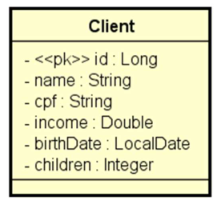

<h1 align="center">DESAFIO: CRUD de clientes</h1>

[ACESSAR  PROJETO](https://github.com/luizzlcs/dsClient/blob/master/src/main/java/com/antares/dsClient/DsClientApplication.java)

## Funcionalidades

Projeto Spring Boot contendo um CRUD completo de web services REST para
acessa um recurso de clientes, contendo as cinco operações básicas:

- Busca paginada de recursos
- Busca de recurso por id
- Inserir novo recurso
- Atualizar recurso
- Deletar recurso

O projeto contém um ambiente de testes configurado acessando o banco de dados H2, usa o
Maven como gerenciador de dependência, e Java como linguagem.

Um cliente possui nome, CPF, renda, data de nascimento, e quantidade de filhos. A especificação da entidade Client é mostrada a seguir:

O projeto faz um seed de pelo menos 10 clientes e O projeto  trata as seguintes exceções:

- Id não encontrado (para GET por id, PUT e DELETE), retornando código 404.

- Erro de validação, retornando código 422 e mensagens customizada para cada campo inválido. 

    As regras de validação são:
    - Nome: não pode ser vazio
    - Data de nascimento: não pode ser data futura

## CHECKLIST DAS FUNCIONALIDADES?
1. Busca por id retorna cliente existente
2. Busca por id retorna 404 para cliente inexistente
3. Busca paginada retorna listagem paginada corretamente
4. Inserção de cliente insere cliente com dados válidos
5. Inserção de cliente retorna 422 e mensagens customizadas com dados inválidos
6. Atualização de cliente atualiza cliente com dados válidos
7. Atualização de cliente retorna 404 para cliente inexistente
8. Atualização de cliente retorna 422 e mensagens customizadas com dados inválidos
9. Deleção de cliente deleta cliente existente
10. Deleção de cliente retorna 404 para cliente inexistente

---
### Autor
Sou desenvolvedor de aplicativos utilizando as tecnologias da google Dart e Flutter, desde 2022 atuo na Ponto Care desenvolvendo soluções para Android e Web, atualmente estou estudando Java para Back-end com a DevSuperior.

